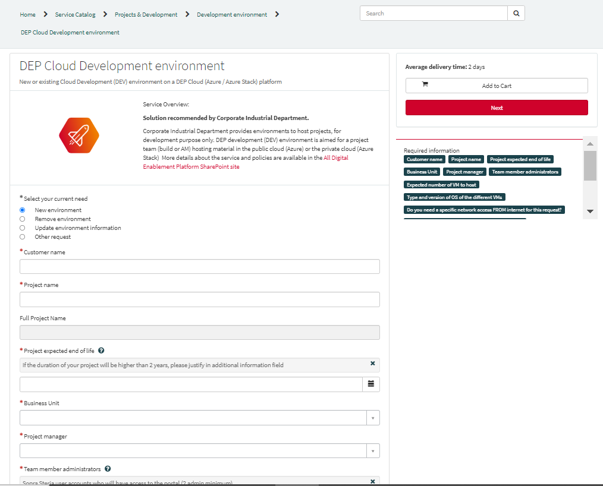
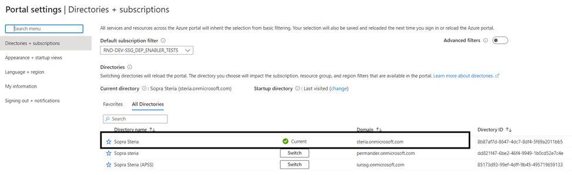
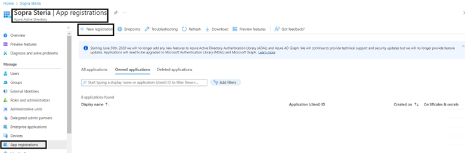
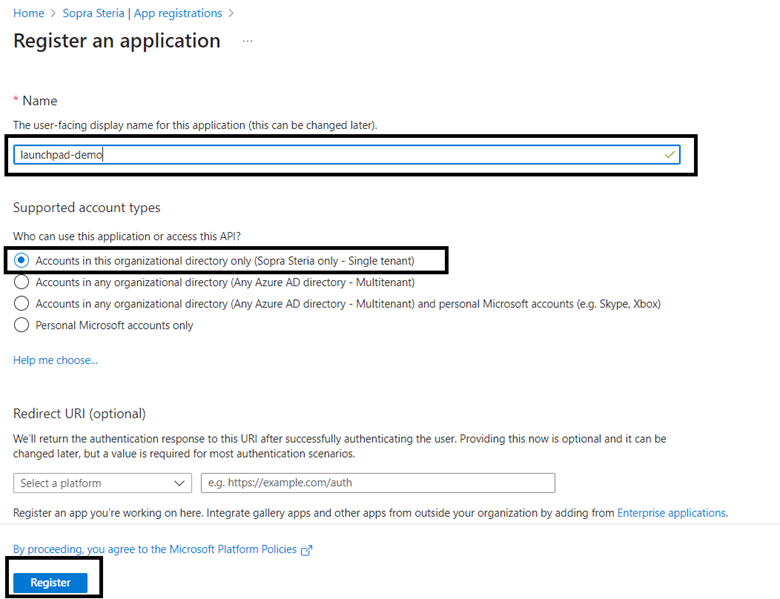
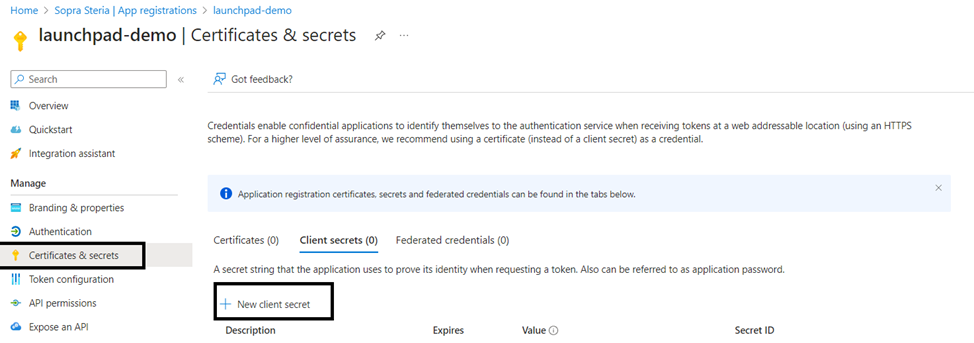
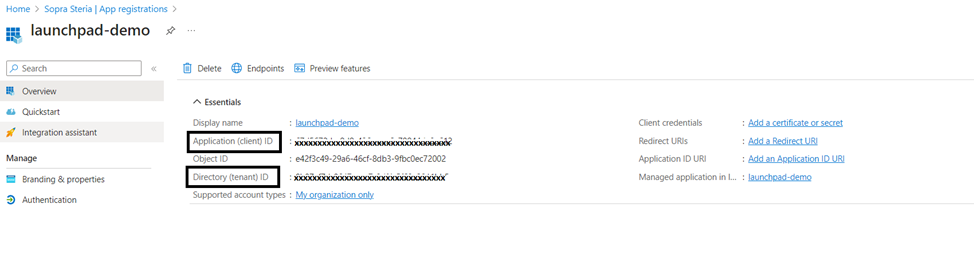
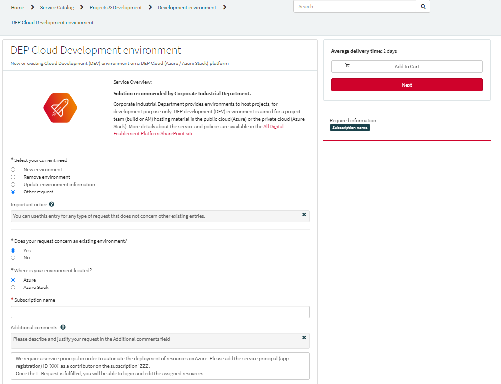

Project will need a **DEP Azure Subscription** and a **Service Principal** with **Contributor Role** on this subscription.

### How to get DEP Azure Subscription

Project will need to raise **Service Request** on [Service Now](https://soprasteriacorp.service-now.com/sp?id=sc_cat_item&sys_id=b20c6d4adbdbdc10934bbe65f3961945&sysparm_category=abf42facdb54f8100548fac2f3961944) to request new DEP cloud development environment under the category of project & developments.

### How to create Service Principal

A Service principal can be created to login to Azure (it's like a technical account). You can then ask to assign the required permissions to the service principal in order to use it with your subscription.

Follow this document https://docs.microsoft.com/en-gb/azure/active-directory/develop/howto-create-service-principal-portal to create your service principal or follow the below steps:

*Go to **Azure portal** and switch to the **Sopra Steria Tenant***

*From the **Azure portal** homepage, go to **Azure Active Directory –> App registrations  –> New Registration***

*Give an appropriate name to the **App Registration** (For demonstration purpose, provided the name as launchpad-demo ) and under **Supported Account Types**, select Accounts in this organizational directory only (Sopra Steria only - Single tenant) and register it.*

*Once the **App Registration** is created, go to Certificates and Secrets and create a new client secret. Give a short description and the relevant expiration time of the secret and create it.*

**Note**: **Do not forget to save the client secret value** once its created.

Note down the client secret value created in above step, Application ID and Tenant ID, refer below screen shot to get the same.

### How to add Contributor Role on the Subscription

💡 The procedure differs between Azure **standard (development)** subscription (that come with some defaults configurations) and **BIZ (production)** subscription (which are more vanilla Azure).

#### How to add Contributor Role on a development Subscription

To perform an automated deployment on to Azure, we need to enable the **service principal**. To do so we need to have proper assignment of the service principal on the subscription. To do this, please **raise an IT request** on [Service Now](https://soprasteriacorp.service-now.com/sp?id=sc_cat_item&sys_id=b20c6d4adbdbdc10934bbe65f3961945&sysparm_category=abf42facdb54f8100548fac2f3961944) asking for applying the service principal on your environment.

*A sample **IT Request** is given below*:

We require a service principal in order to automate the deployment of resources on Azure. Please add the service principal (app registration) ID ‘XXX’ as a contributor on the subscription ‘ZZZ’.
Once the IT Request is fulfilled, you will be able to login and edit the assigned resources.

#### How to add Contributor Role on a BIZ Subscription/Sandbox Subscription

If you are using a BIZ (production) subscription or Sandbox Subscription a specific configuration of the service principal is needed.

DEP launchpad for AKS is expecting the service principal to be **member** of a **contributor group** (that does not exists by default on BIZ subscriptions/Sandbox Subscription). Failing to create this group triggers a failure of the AKS deployment script.
_Other component of Launchpad (like project foundation) do not use this group and may work fine without it._

Workaround/fix is to:
- **Create a group** in the AD
- **Add the service principal** (that you previously created) **in this group**
- Give **contributor** role **to the group** on the subscription. (It is important to do it at group level even if the service principal already has contributor role on the subscription).